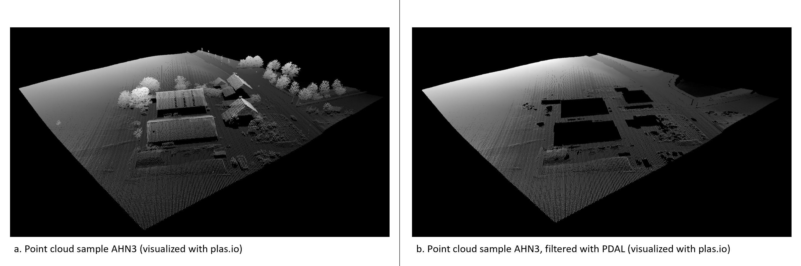
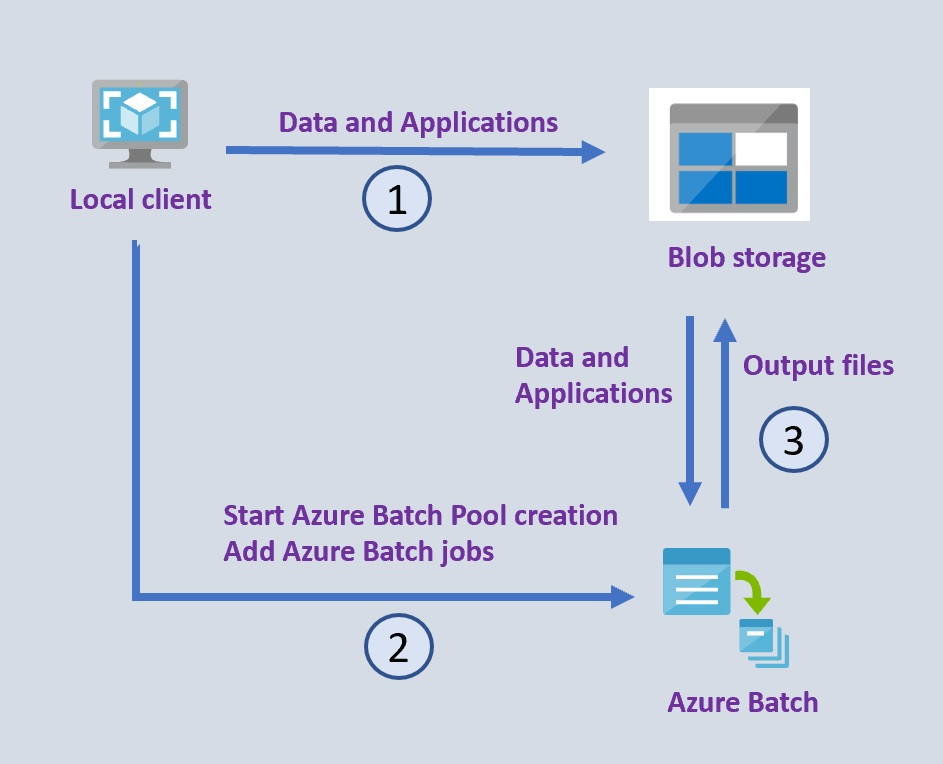

## Note: Azure Batch (general):
For general Azure Batch description, hop two levels up this repo ([link](https://github.com/delange/lidar-batch-python)), as this LiDAR example repo holds its foundations on the [Azure Batch samples](https://github.com/Azure-Samples/azure-batch-samples/tree/master/Python/Batch) that came with the Azure Batch overview. 

# Processing LiDAR data at scale with Azure Batch and PDAL

In this repository you will find the code to process LiDAR data with [PDAL](https://pdal.io/) pipelines at scale with [Azure Batch](https://docs.microsoft.com/en-us/azure/batch/batch-technical-overview).

This repository is the technical back-bone from a [blog post](link) where the concept of the PDAL pipeline and processing with Azure Batch are explained.

As input data for this example we make use of a sample the third edition of the Dutch nationwide LiDAR open dataset [AHN3](https://www.ahn.nl/). The dataset has been acquired with airborne laser scanning.

The pipeline on Azure is applied on the provided sample dataset, a laz file containing AHN3 data from an area of 150m x 150m, see below an impression of the input data, and the resulting applied pipeline and filter, showing only the ground pulses. Visualization is made with the use of [plas.io](https://plas.io) 

## General set-up

There are three steps to follow when the Azure Batch Python SDK is used to manage the Azure Batch processing with a local Python client:
1) local client upload data and application files to Azure Blob Storage, 
2) with the Python SDK of Azure Batch, the local client starts the creation of an Azure Batch Pool, and then can add Azure batch jobs to run on the LiDAR files, 
3) Azure Batch automatically schedules the job and tasks, execute the processing and upload output files to Azure Blob Storage.  

#### Pre-requisites:

You should have access to a resource group, with contributor roles for the following two resources in the group:
-   an Azure Storage account
-   an Azure Batch account

#### 1. Local client to upload to Azure Blob storage
The batch_python_linux.py runs locally as a client for Azure Batch and uploads to Azure Blob storage. Before the client can do this, some Azure service characteristics should be set in config.py. These are:
- the batch account name 
- batch account key
- batch account URL
- storage account name
- storage account URL
- storage account key
Besides, some Azure Batch Pool parameters need to be set here as well, like the size of the pool, e.g. the number of nodes (VMs), the VM type.
The following two libraries should be installed in the local environment:
- azure-batch (10.0.0 was used)
- azure-storage-blob (12.8.1 was used)

Three containers will be created and data uploaded:
- lidarapplication : the applications to run on Azure Batch, uploaded from this project directory ApplicationFiles
- lidarinput : the (LiDAR) data to be processed, uploaded from this project directory InputFiles
- lidaroutput : Azure Batch produces results, and will be uploaded from Azure Batch to the blob storage container.

#### 2. Local client to create Azure Batch Pool and to submit jobs
Through the client, an Azure Batch Pool will be created. Reference is made to the resource files, in this case the blobs in the lidarapplication container, so that the pool will retrieve these files. During creation of the pool command line statements can be provided to be executed during creation. Here, this includes also the execution of a batch script: starttask.sh (uploaded from ApplicationFiles to blob storage in previous step).
With the starttask.sh, a mini conda installer will be downloaded, installed, initialized and activated. The here needed PDAL library is installed from Conda-Forge.

Also throught the client, Azure Batch jobs and task can be submitted. There is also the possibility to execute command line statements when a task gets created, and here the task.sh script is executed, to have the mini conda also activated at each node, and to start the real processing with the lidar_application.py. This python script will be executed for each input file as a Batch task (one job can have many tasks).

#### 3. Azure Batch processing
As with the submission of Azure Batch jobs, for each input file an Azure Batch task, the lidar_application.py get executed. And the defined PDAL pipeline, within that script, get exectuded. Azure Batch will schedule the job and task over the profisioned cluster automatically. The results, in this case the las files, will be uploaded to the Azure Blob container: lidaroutput

#### Supporting tools
[Azure Storage Explorer](https://azure.microsoft.com/en-us/features/storage-explorer/): to interact with Azure storage

[Azure Batch Explorer](https://azure.github.io/BatchExplorer/): to interact with Azure Batch accounts/pools/nodes, reducing the need to ssh into the VMs.

